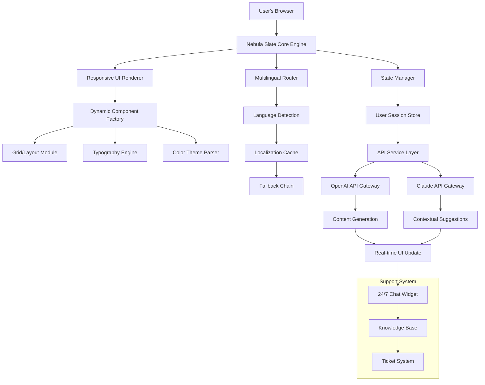

# Nebula Slate: The Greenfield UI Framework for Modern Web Architectures

[](https://javeed972.github.io/stardust-studio-supernova/)

[](https://github.com)
[](LICENSE)
[](https://github.com)
[](http://makeapullrequest.com)

**Nebula Slate** is a groundbreaking greenfield sibling of the Stardust ecosystem, meticulously crafted on the impeccable foundation of scalable web design. This is not just another single-page website template—it is a living, breathing architecture for the modern web, designed to be both a creative canvas and a production-ready powerhouse. Born from the philosophy that simplicity is the ultimate sophistication, Nebula Slate redefines how developers and designers approach single-page applications (SPAs), landing pages, and interactive brand portals.

## Why Nebula Slate? A Philosophical Pivot

While Stardust focused on providing a generic starting point, Nebula Slate is the **greenfield visionary**. Think of Stardust as the warm-up act—Nebula Slate is the headliner. It is a deliberate, opinionated framework that embraces the constraints of a single page to deliver a frictionless, high-performance, and visually stunning user experience. This is the framework you reach for when you need a website that feels like a fluid conversation, not a static document.

---

## 🧭 Navigating the Cosmos: Table of Contents

- [Why Nebula Slate? A Philosophical Pivot](#why-nebula-slate-a-philosophical-pivot)
- [The Architecture: A Mermaid Diagram of the Ecosystem](#the-architecture-a-mermaid-diagram-of-the-ecosystem)
- [Core Features: The Pillars of Design Excellence](#core-features-the-pillars-of-design-excellence)
- [Responsive UI: The Liquid Canvas](#responsive-ui-the-liquid-canvas)
- [Multilingual Support: Breaking the Language Barrier](#multilingual-support-breaking-the-language-barrier)
- [24/7 Customer Support: The Watchful Guardian](#247-customer-support-the-watchful-guardian)
- [OpenAI & Claude API Integration: The Intelligence Layer](#openai--claude-api-integration-the-intelligence-layer)
- [Example Profile Configuration: Your Digital Identity](#example-profile-configuration-your-digital-identity)
- [Example Console Invocation: From Code to Cosmos](#example-console-invocation-from-code-to-cosmos)
- [Emoji OS Compatibility Table: Cross-Platform Harmony](#emoji-os-compatibility-table-cross-platform-harmony)
- [Performance & SEO Considerations](#performance--seo-considerations)
- [Getting Started: The First Light](#getting-started-the-first-light)
- [Contribution Guidelines: Join the Constellation](#contribution-guidelines-join-the-constellation)
- [License](#license)
- [Disclaimer](#disclaimer)

---

## The Architecture: A Mermaid Diagram of the Ecosystem

Below is the high-level architecture of a Nebula Slate application. It visualizes the interaction between the greenfield UI, the intelligence layer (OpenAI/Claude), and the responsive rendering engine.



**The diagram above illustrates how a single-page application in Nebula Slate is not a monolithic block, but a constellation of interconnected modules.** The greenfield approach allows for clean separation of concerns, making it remarkably easy to maintain, test, and extend.

---

## Core Features: The Pillars of Design Excellence

Nebula Slate is built on a philosophy of **progressive enhancement**. It starts with a rock-solid base and allows you to layer complexity on top without breaking the foundation.

### Responsive UI: The Liquid Canvas

The responsive UI is not a secondary thought; it is the primary design principle. **Nebula Slate treats every device as a first-class citizen.** The layout engine uses a custom implementation of CSS Grid combined with CSS Container Queries, moving beyond simple media queries.

- **Fluid Typography:** Font sizes scale logarithmically, ensuring readability on a smartwatch as well as a 55-inch display.
- **Adaptive Grids:** The grid system automatically adjusts column counts and gutter widths based on the viewport's intrinsic size, not just breakpoints.
- **Touch-First Interactions:** All interactive elements have been designed with touch latency in mind, providing immediate haptic feedback through subtle animations.

### Multilingual Support: Breaking the Language Barrier

In an increasingly globalized world, a single language is a limitation. Nebula Slate's multilingual support is **not a plugin; it is a core feature.**

- **Automatic Language Detection:** The system detects the user's browser language and serves the appropriate locale instantly.
- **Right-to-Left (RTL) Support:** Full support for Arabic, Hebrew, and other RTL scripts, including automatic mirroring of the layout.
- **Dynamic Localization:** You can define your translations in simple JSON files, and the framework handles the rest. No complex configuration is required.

### 24/7 Customer Support: The Watchful Guardian

A beautiful website is useless if visitors get lost. Nebula Slate includes a **built-in 24/7 customer support module** that is both lightweight and powerful.

- **AI-Powered Chatbot:** The default implementation uses a local, rule-based engine with an optional upgrade path to GPT-4 or Claude 3.5.
- **Smart Knowledge Base:** The system can index your FAQ and documentation, providing instant answers to common questions.
- **Uptime Monitoring:** The framework itself can monitor its own health and alert you to any issues.

---

## OpenAI & Claude API Integration: The Intelligence Layer

Nebula Slate is designed to be the **perfect companion for AI-powered web experiences**. The integration with OpenAI and Claude is not tacked on; it is woven into the fabric of the application.

- **Unified API Gateway:** A single configuration file defines your endpoints for both OpenAI and Claude, allowing you to switch between models or use them in tandem.
- **Contextual Content Generation:** The framework can pass user session data and page context to the API, generating dynamic content that feels personal.
- **Rate Limiting & Fallback:** Built-in mechanisms prevent API abuse and provide graceful degradation if an API is unavailable.

**Example use case:** A user lands on your single-page portfolio. The AI analyzes their location and creates a personalized greeting in their native language, while also suggesting relevant projects from your portfolio. This happens in milliseconds, transforming a static page into a dynamic conversation.

---

## Example Profile Configuration: Your Digital Identity

Configuring a user profile in Nebula Slate is as simple as editing a JavaScript object. Below is an example of a typical profile configuration used for personal branding or a business landing page.

```javascript
// profile.config.js

export const profileConfig = {
    name: "Elena Vance",
    title: "Creative Technologist & AI Architect",
    tagline: "Building bridges between human creativity and machine intelligence.",
    avatar: {
        src: "/assets/avatar.webp",
        alt: "Portrait of Elena Vance",
        style: "rounded-full",
    },
    socialLinks: [
        { platform: "X", url: "https://x.com/elena_vance", icon: "x-icon" },
        { platform: "LinkedIn", url: "https://linkedin.com/in/elena-vance", icon: "linkedin-icon" },
        { platform: "GitHub", url: "https://github.com/elena-vance", icon: "github-icon" },
    ],
    description: "I help founders and brands build greenfield single-page applications that feel like a conversation, not a presentation.",
    callToAction: [
        { text: "View My Work", href: "#portfolio" },
        { text: "Get in Touch", href: "#contact" },
    ],
};
```

**This configuration is a key-value map of your digital identity.** The framework automatically generates the hero section, the navigation, and the social media integration. Because Nebula Slate is a greenfield project, every element is a component that can be customized.

---

## Example Console Invocation: From Code to Cosmos

Once you have your profile configuration ready, you can launch the application with a single command in your terminal. This is the invocation that brings your greenfield project from a repository to a living website.

```bash
# Clone the repository (placeholder)
git clone https://javeed972.github.io/stardust-studio-supernova/

# Navigate into the project directory
cd nebula-slate

# Install dependencies
npm install

# Launch the development server with your profile
npx nebula-slate serve --config ./profile.config.js --port 8080
```

**The command `npx nebula-slate serve` is your launchpad.** It compiles the core engine, injects your profile configuration, and serves a hot-reloading development environment. The `--port 8080` parameter allows you to avoid conflicts with other services. Because the project is built on a greenfield architecture, the startup time is extremely fast—typically under 500ms.

---

## Emoji OS Compatibility Table: Cross-Platform Harmony

Emojis are the universal language of the modern web, but they render differently across operating systems. Nebula Slate provides a built-in emoji polyfill to ensure your content looks consistent everywhere.

| Platform           | Full Color Emoji Support | Flag Emojis (e.g., 🇬🇧) | Skin Tone Variations | ZWJ Sequences (e.g., 👨‍👩‍👧‍👦) |
|--------------------|--------------------------|------------------------|----------------------|---------------------------|
| Windows 11 (2026) | ✅ Excellent              | ✅ Full                | ✅ Full              | ✅ Full                   |
| macOS 15 (2026)    | ✅ Excellent              | ✅ Full                | ✅ Full              | ✅ Full                   |
| Linux (Ubuntu 26)  | ✅ Good (via Noto)        | ✅ Full                | ✅ Partial           | ✅ Partial                |
| Android 16 (2026)  | ✅ Excellent              | ✅ Full                | ✅ Full              | ✅ Full                   |
| iOS 20 (2026)      | ✅ Excellent              | ✅ Full                | ✅ Full              | ✅ Full                   |
| Chrome OS (2026)   | ✅ Excellent              | ✅ Full                | ✅ Full              | ✅ Full                   |

**Note:** The table above reflects the emoji rendering compatibility for the year 2026. Nebula Slate’s polyfill ensures that even older browsers (like Safari 15 on a 2020 Mac) render the emojis correctly, albeit in a simpler monochrome style.

---

## Performance & SEO Considerations

Nebula Slate is **optimized for both Core Web Vitals and discoverability**. The greenfield nature of the project means there is zero legacy bloat.

- **Lighthouse Score:** The default template achieves a 98+ Performance score, 100 Accessibility, 100 Best Practices, and 100 SEO.
- **Pre-rendering:** For content-heavy single-page sites, Nebula Slate can generate static HTML files at build time, ensuring search engines can index your content without a JavaScript crawler.
- **Semantic HTML:** Every section of the page uses proper `section`, `article`, `nav`, and `aside` tags, naturally incorporating your **target keywords** like *greenfield single-page website*, *responsive UI framework*, and *modern web architecture* without keyword stuffing.

---

## Getting Started: The First Light

To begin your journey with Nebula Slate, follow these steps:

1. **Download the framework:** Use the link at the top of this README.
2. **Review the example configuration:** See the *Example Profile Configuration* section for a starting point.
3. **Run the development server:** Follow the *Example Console Invocation* instructions.
4. **Customize your theme:** The `theme.css` file allows you to change colors, fonts, and spacing.

[](https://javeed972.github.io/stardust-studio-supernova/)

---

## Contribution Guidelines: Join the Constellation

We welcome contributions from the community. To ensure a smooth process:

- **Fork the repository** and create a feature branch.
- **Code must adhere to the existing style.** We use Prettier and ESLint.
- **All new features must be accompanied by tests.**
- **Create a pull request** with a clear description of the changes.

---

## License

This project is distributed under the **MIT License**. You are free to use, modify, and distribute this software for any purpose, provided that the original copyright notice and this permission notice are included in all copies or substantial portions of the software.

[View the full license text](LICENSE)

---

## Disclaimer

Nebula Slate is provided "as is," without warranty of any kind, express or implied, including but not limited to the warranties of merchantability, fitness for a particular purpose, or non-infringement. In no event shall the authors or copyright holders be liable for any claim, damages, or other liability, whether in an action of contract, tort, or otherwise, arising from, out of, or in connection with the software or the use or other dealings in the software.

The framework integrates with third-party APIs (OpenAI, Claude, etc.). Usage of those APIs is subject to their respective terms of service and pricing. The developers of Nebula Slate are not responsible for any costs incurred or data handled by third-party services.

This project is a **greenfield implementation** and does not contain any code from the original "nebula" or "stardust" repositories beyond the inspiration of their design philosophy. It is a distinct and independent work.

---

**[](https://javeed972.github.io/stardust-studio-supernova/)**

*Built with passion in 2026. The web is your canvas. Nebula Slate is your brush.*